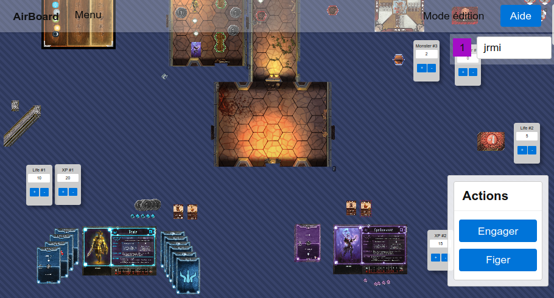
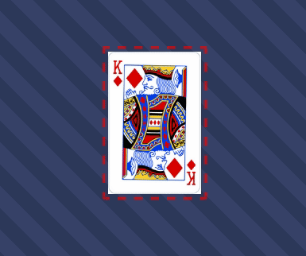
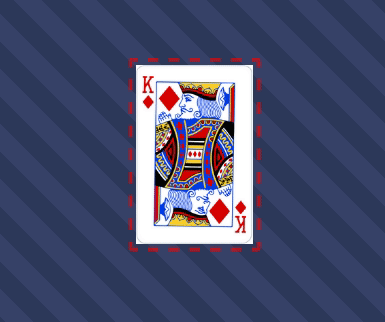
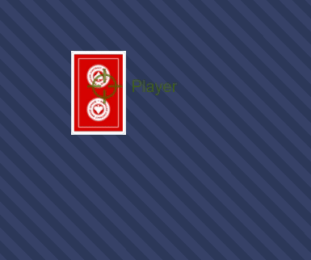
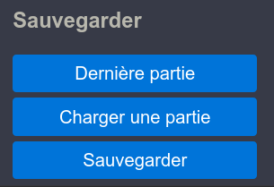

# Air board game

Play any board game online in real time with your friends thanks to this [tabletop simulator](https://airboardgame.netlify.app).

If you just want to play, go [here](https://airboardgame.netlify.app).

No need to create an account, just join a room, share the link with your pals, choose a game and play.
Simple, fast and efficient.

## What is it?



Airboardgame is a tabletop simulator to play your favorite board games with your
friends online. It's not a game engine, it's just a tabletop simulator of what you can
do with a real table. Just share a common space with other players.

Airboardgame doesn't force you, you make the rules.
Airboardgame is just a game table simulator : what you would do with a real
table you can/must do with Airboargame.

Airboardgame is not only designed to play games but also to create them.
In just a few minutes you can create simple games without having any
development skills to play with your friends.
Want to test a concept? Play a Print & Play game? Use airboardgame without the need for more hardware.
The only limit is your imagination.

We want Airboardgame to be simple, intuitive and consistent web application.
Just give a try and if you like it share it and contribute.

## Features

### For players

Flip card items.



Tap items.



Flip cards only for you, like hand cards.


See others cursors and how they move in real time.



Save and restore game.



and more…

### For game designers

- Create items like
  - Round,
  - Rectangle,
  - Dice,
  - Note,
  - Counter,
  - Image that can represent cards, board, token, perks, …
  - …
- Choose board size
- Add available items not on the board but in the "game box" like extension or

## Technical details

- Open source web application
- Made with React and Socket.io,
- Client to client architecture. Very slim and dumb server is needed for
  message passing, clients handle anything else.
  
## Installation for developpers

You need a recent node version. You can use nvm to initialize your environment.
Then, execute

```sh
npm ci # To install dependencies
```

Configure the environement:

Copy the `.env.dist` file without the `.dist` extension and edit it to fit your
needs.

Now you can start the server:

```sh
npm run server
```

Then you can run the client:

```sh
npm start
```
