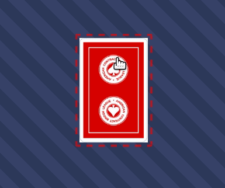
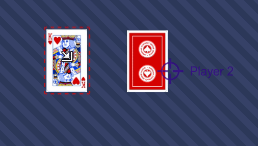

# Air board game - the free online tabletop simulator

Join us on Discord - [](https://discord.gg/EsZGJ5h6UA)

If you just want to play, go [here](https://airboardgame.net).

* **Choose** a game
* **Share** the link with your friends
* **Play** together

Simple, fast and efficient.

No need to create an account, choose a game from the list ([or create yours](#game-designer-its-also-for-you)) share
the displayed link with your friends by mail or any channel you have in common
and wait for your friends to join you.

## A tabletop simulator ?


Airboardgame is a tabletop simulator to play your favorite board games with your
friends online. It's not a game engine, it's just a tabletop simulator of what you can
do with a real table. You share a common space with other players like if you were is the same room.
If you move something or if you flip a card, other players see
this action and can respond in real time.

Hint: you really should use an audio conference application to speak with other players.

Airboardgame doesn't force you, you make the rules.
Airboardgame is just a game table simulator : what you would do with a real
table you can/must do it with Airboargame.

## Features for players

Flip card items.


Tap items.


Flip cards only for you, like hand cards.



See other players cursor on the shared board and how they move in real time.
You can show things, see what they are doing, …



Save and restore game.


and more…

## Game designer, it's also for you

Airboardgame is not only designed to play games but also to create them.
In just few minutes you can create simple games without any
development skills and play with your friends.

Wants to test a concept? Play a Print & Play game? Use airboardgame without
the need for more hardware.

The only limit is your imagination.

To access this features, login then click on the « create new game » button on home page.

We want Airboardgame to be simple, intuitive and a consistent web application.
Just give a try and if you like it share it and contribute.

You can create a game with simple actions :

* Create items like
  * Round,
  * Rectangle,
  * Dice,
  * Note,
  * Counter,
  * Image that can represent cards, board, token, perks, …
  * …
* Choose board size
* Add available items not on the board but in the "game box" like extension or material for more user.

You can drag'n'drop image from your desktop to the board to use them in Airboardgame.

## Technical details

* Open source web application,
* Made with React and Socket.io,
* Use recoiljs as state management,
* Client to client driven architecture.
  
## Installation instructions

This is the procedure to install AirBoarGame application from scratch for
development purpose.
You need a recent node version. You can (and should) use [nvm](https://github.com/nvm-sh/nvm)
to initialize your environment.

### Backend

First you need to install and start the server part of the application.
The server code use [Ricochet.js](https://github.com/jrmi/ricochet.js). A local
instance is installed and can be started but you can use your own instance.

To proceed, execute:

```sh
cd backend
npm ci
cp .env.dist .env
```

You have the opportunity to modify Ricochet.js configuration now by editing this
file. Default values should be fine for test but remember that data are only kept in
memory so you loose all your changes each time you restart the ricochet server
with this default. You also must to register again your site.
See [Ricochet.js](https://github.com/jrmi/ricochet.js) documentation for more
options and how to make data to persist.

Now you can start the ricochet server:

```sh
npm run ricochet
```

Then you must create the Airboardgame ricochet site by visiting your ricochet
server URL with a browser and fill the site creation form. Default Ricochet
server URL if you didn't modify configuration should be `http://localhost:4050/`.

The only important value here is `site Id` that should have the `airboardgame`
value.

Since the form is submitted, save the key from the server response and customize
`.env` file using this key to set the `RICOCHET_SITE_KEY`.

Remember to confirm the site creation by clicking the link displayed in Ricochet.js
sever logs if you use the default configuration for SMTP.

Now, you should start backend code modifications monitoring to generate
code executed by Ricochet.js in another terminal:

```sh
npm run watch
```

you also need an instance of `wire.io` so in another terminal, execute:

```sh
# /!\ Need npm >= v7
PORT=4051 npx wire.io
```

See [wire.io](https://github.com/jrmi/wire.io) documentation for more information
on how to configure it.

### Client

In another terminal, go back to project root and execute:

```sh
cd <project_root>/
npm ci
cp .env.dist .env
```

Edit the `.env` file to fit your needs. Default should be fine if you didn't
modify server configuration.

Then you can start the client:

```sh
npm start
```

Now you should have four terminals:

* the one with Ricochet.js server instance. Backend logs can be found here
* one terminal with auto build on change for backend files
* another with `wire.io` server running
* and a last one with React frontend server
