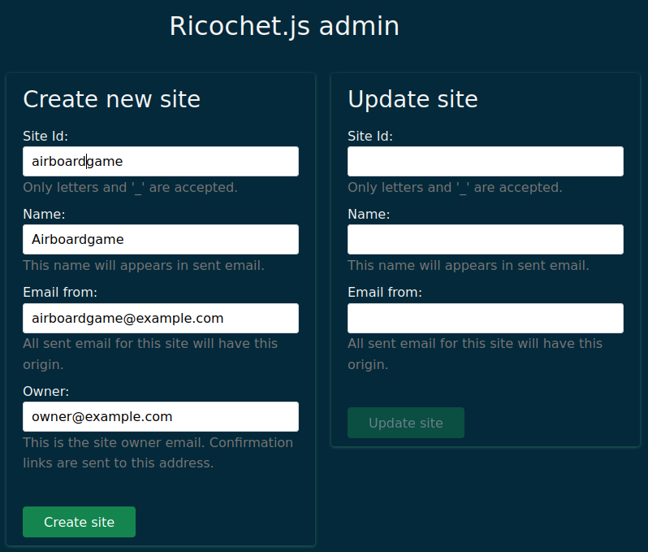
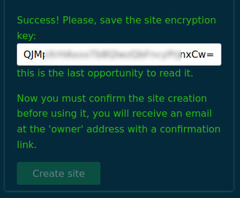
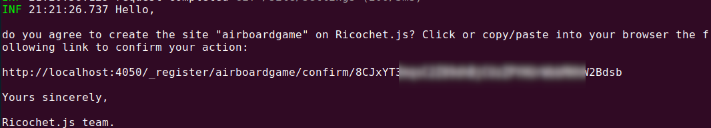

# Developper documentation

Developper documentation is currently poor but don't hesitate to help writing it.

# Installation instructions

This is the procedure to install AirBoarGame application from scratch for
to initialize your development environment, or simply to have the system in
your own machine / server and host games or play.

AirBoarGame application contains two parts:

- a **server part (named Backend)**
- and a **client part**.

## Prerequisite

1. You need **Node.js** >= v16 with **npm** >= v7. For that, you can (and should)
  use [nvm](https://github.com/nvm-sh/nvm) to install and manage your Node.js environment.
  Execute `nvm use` in project root folder to start the right environment.

2. You need to download the last version of AirBoardGame [source code](https://github.com/jrmi/airboardgame)
  into a local folder. You can get it:

- By downloading the source [zip file](https://github.com/jrmi/airboardgame/archive/refs/heads/master.zip) and decompress it into a local folder.
- By cloning it with git : `git clone git@github.com:jrmi/airboardgame.git`. You may need to create a github account to proceed this way.

## Backend 1/2 - start and configure Ricochet.js server

First, you need an up and running instance of [Ricochet.js](https://github.com/jrmi/ricochet.js)
server. You can create yours by following the instructions in this section or you can
use any existing instance.

To start a local instance, execute:

```sh
cd backend
npm ci # install dependencies
cp .env.dist .env
```

Now, you have the opportunity to customize Ricochet.js configuration by editing the
`.env` file. Default values should be fine for quick testing purpose but remember
that data are only stored in memory so you'll loose
all your changes each time you stop the ricochet.js server with these defaults.

Don't try to fill the `RICOCHET_SITE_KEY` already because you need to register the
Airboardgame site before, but you might want to change the `STORE_BACKEND`
and `FILE_STORE` here to persist data.

Here's an example configuration to persist data locally:

```sh
FILE_STORE_BACKEND=disk
DISK_DESTINATION=/path/to/directory/

JSON_STORE_BACKEND=nedb
NEDB_DIRNAME=/path/to/nedb/database
```

The two configured paths should be existing and have write permissions for current user.

See [Ricochet.js](https://github.com/jrmi/ricochet.js) documentation for more
options.

Now you can start the ricochet.js server:

```sh
npm run ricochetjs
```

Then create the Airboardgame Ricochet site by visiting your ricochet.js
server URL with a browser and fill the site creation form. Default Ricochet
server URL, if you haven't modified the configuration should be `http://localhost:4050/`.

This is a 3 step process:

1) Fill the site creation form with valid data
2) Validate the form and save the secret site key for later use
3) Visit the confirmation link to activate the site

### Step 1 - Fill the site creation form

The only important value here is `Site id` that should have the `airboardgame`
value.

Here's an example:



### Step 2 - Validate the form and save the site secret key

Submit the form by clicking the *create site* button.



Since the form is submitted, save the displayed key and customize
`.env` file using this key to set the `RICOCHET_SITE_KEY`.

### Step 3 - Activate the site by clicking the confirmation link

Remember to confirm the site creation by clicking the link sent by Ricochet.js to
the owner email. If your are using a local instance of ricochet with the `fake`
server email (should be the default configuration) the mail is displayed in the
ricochet.js console.



Otherwise ensure you have given a valid email address and
check the spam if you don't receive the email.

Now you can stop the ricochet.js server (we are going to start it with the rest
of the stack in the next step) by using `ctrl+c` in the server shell.

## Backend 2/2 - Start the backend stack

To start the stack just execute:

```sh
npm run all
```

Actually, this command launch 3 other commands:

- `npm run ricochejs` for the Ricochet.js server
- `npx wire.io@latest` for the realtime [wire.io](https://github.com/jrmi/wire.io) websocket relay
- `npm run watch` that watch for backend code modifications to build the backend `ricochet.json` file.

If you need more informations or more flexibility you might want to visit *More details on server* section.

In the next section your going to start the web client that connect to this server part.

## Client

In another terminal, go back to project root and execute:

```sh
cd <project_root>/
npm ci
cp .env.dist .env
```

Customize the `.env` file. Default should be fine if you haven't modified
server configuration host and port.

Then you can start the client:

```sh
npm start
```

The last command should open the frontend URL in your browser.

Now you should have two terminals:

- first with:
  - the Ricochet.js server. Backend logs can be found here.
  - a `wire.io` server running
  - and the auto build on change for airboardgame backend files
- and another with web-frontend server

# (Optionnal) More details on server

When you start the backend part of Airboardgame, you need to start 3 commands.
You can start all by using the `npm run all` command but sometimes you may want
more control over how everything is working, for deployment or debugging. In this
section you'll find a quick explanation of each command.

## Ricochet.js server

You can start the `Ricochet.js` server by executing:

```sh
npm run ricochetjs
```

If you need more details on `Ricochet.js` please visit the
[project page](https://github.com/jrmi/ricochet.js).

## Watch & build the backend Airboargame code

You can start backend code modifications monitoring to generate
code executed by Ricochet.js from the `backend/` directory:

```sh
npm run watch
```

You also can generate the backend code once by executing:

```sh
npm run build
```

These two commands generate the `public/ricochet.json` file that is executed
on Ricochet.js server. This is the actual Airboardgame specific backend code.

## Start wire.io socket.io server relay

To allow real time communication between clients, you need to start an
instance of [wire.io](https://github.com/jrmi/wire.io) server.

To proceed, execute in the `backend/` directory:

```sh
# /!\ Need npm >= v7
npx wire.io@latest
```

See [wire.io](https://github.com/jrmi/wire.io) documentation for more information
on how to configure it if you need more options.

# Launch e2e tests

Execute the following command:

```sh
npm run cypress:open
```

This open the [Cypress](https://www.cypress.io/) console.

# Deploy a production instance

Section in progress...

To deploy an instance in production you need to deploy the same stack as in dev.

- You need a Ricochet.js instance.
- You need a Wire.io instance.
- Build the backend `ricochet.json` file.
- Build the frontend and deploy it to a CDN.

# Contributing guide

Section in progress...

## Z-index stack

- 250 -> 299 : Top UI element like modals, Color selector, ...
- 200 -> 249 : over items like navbar, side panels, selector, cookie notice, bottom button bar...
- 100 -> 199 : items zone. All items on the board have these values
- 0 -> 99 : underlay like board, background, ...
